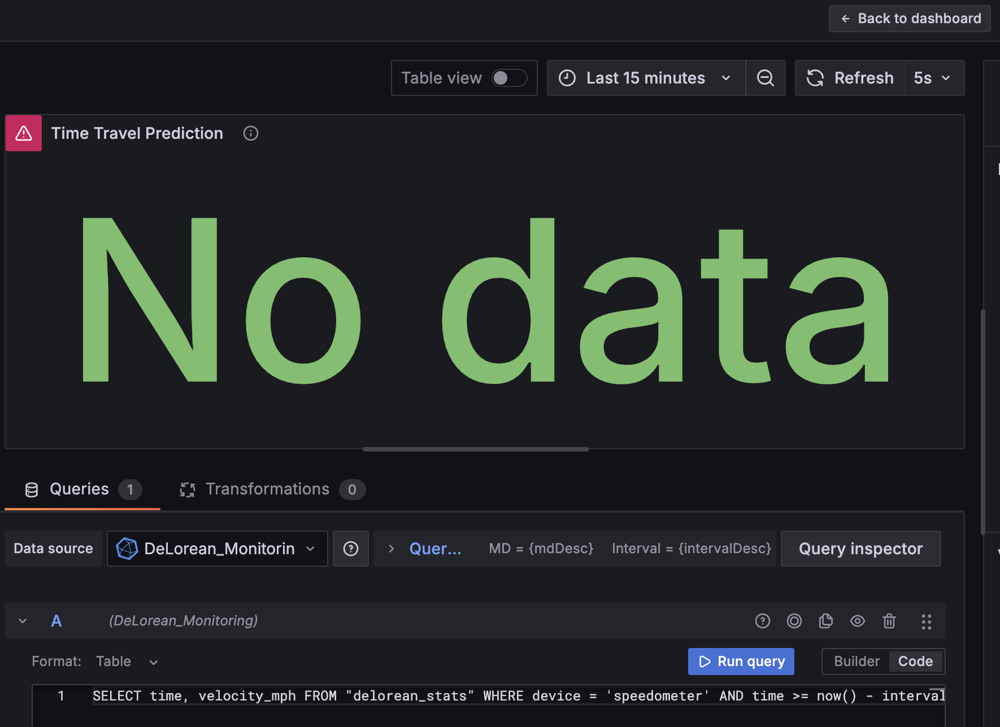

# DeLorean Monitoring - Example for Time Series Data


A demonstration project showing how to work with time series data using modern tools and techniques, all presented with a fun "Back to the Future" theme!

## Architecture Overview

The DeLorean Monitoring system uses a three-tier architecture to collect, store, and visualize time series data:


**Data Flow:**
1. The .NET application generates simulated DeLorean metrics
2. Data is formatted in InfluxDB Line Protocol format
3. Data is sent to InfluxDB Cloud via HTTP API
4. Grafana queries InfluxDB using SQL
5. Dashboards display real-time metrics and analytics

## Prerequisites

### Software Requirements
- **[.NET 9 SDK](https://dotnet.microsoft.com/download/dotnet/9.0)** - Latest version
  - Required for running and building the data generator
  - Minimum version: .NET 9.0 Preview 2 or later
  - Includes required packages:
    - Microsoft.Extensions.Hosting
    - Microsoft.Extensions.Http

- **[Visual Studio Code](https://code.visualstudio.com/)** (recommended) or Visual Studio 2022
  - With C# extension installed
  - Or any IDE that supports .NET development

- **[InfluxDB Cloud Account](https://cloud2.influxdata.com/signup)**
  - Free tier is sufficient for this demo
  - Provides serverless time series database
  - Requires:
    - Organization name
    - API token with write access
    - Bucket with at least 7-day retention

- **[Grafana Cloud Account](https://grafana.com/auth/sign-up/create-user)**
  - Free tier is sufficient
  - For dashboard visualization
  - Ability to add InfluxDB as a data source

### System Requirements
- **Operating System**: Windows 10/11, macOS, or Linux
- **Memory**: Minimum 2GB RAM (4GB recommended)
- **Storage**: At least 100MB free space
- **Internet Connection**: Required for cloud services

### Network Requirements
- Outbound HTTPS access to:
  - InfluxDB Cloud API endpoints
  - Grafana Cloud API endpoints
- No inbound connections required

## Setup Guide

### 1. InfluxDB Cloud Setup

1. **Sign up for InfluxDB Cloud**
   - Go to [InfluxDB Cloud](https://cloud2.influxdata.com/signup)
   - Create a free account or sign in

2. **Create a Bucket**
   - Navigate to "Load Data" > "Buckets"
   - Click "Create Bucket"
   - Name it "gigawatt_metrics"
   - Set retention period to 7 days

3. **Generate API Token**
   - Go to "Load Data" > "API Tokens"
   - Click "Generate API Token"
   - Select "All Access Token"
   - Copy and save this token securely

### 2. DeLorean Data Generator Setup

1. **Clone this Repository**
   ```bash
   git clone https://github.com/Quorralyne/DeLoreanMonitoring.git
   cd DeLoreanMonitoring
   ```

2. **Configure InfluxDB Credentials**
   - Open `Program.cs` in the root directory
   - Update the following variables in the `DeLoreanDataGeneratorService` class:
   ```csharp
   _influxUrl = "https://your-influxdb-url.aws.cloud2.influxdata.com/api/v2/write";
   _influxToken = "your_influx_token_here";
   _influxOrg = "your_org";
   _influxBucket = "gigawatt_metrics";
   ```

3. **Run the Application**
   ```bash
   dotnet build
   dotnet run
   ```
   
4. **Verify Data Generation**
   - You should see console output showing data points being generated
   - Check your InfluxDB Cloud interface to confirm data is being received

### 3. Grafana Dashboard Setup

1. **Create InfluxDB Data Source in Grafana**
   - Sign in to your Grafana Cloud account
   - Navigate to Configuration > Data Sources
   - Click "Add data source" and select "InfluxDB"
   - Configure with these settings:
     - Name: DeLorean Monitoring
     - URL: Your InfluxDB Cloud URL (without the /api/v2/write path)
     - Query Language: SQL
     - Database: `YOUR_ORG_NAME/gigawatt_metrics` (replace with your org name)
     - Token: Your InfluxDB API token
   - Add these HTTP Headers:
     - Name: `Authorization`, Value: `Token YOUR_INFLUX_TOKEN`
     - Name: `Content-Type`, Value: `application/json`
     - Name: `Accept`, Value: `application/json`
   - Click "Save & Test"

2. **Import the Dashboard**
   - Go to Dashboards > Import
   - Click "Import" in Grafana
   - Upload the `grafana/delorean_monitoring_dashboard.json` file from this repo
   - Select your InfluxDB data source when prompted
   - Click "Import"

3. **Configure Dashboard Panels**
   - After importing, you'll need to manually refresh each panel:
   - Click on a panel title and select "Edit"
   - Select your "DeLorean Monitoring" data source again to refresh
   - You should see data visually appear
   - Repeat for all panels

## SQL Queries for Dashboard Panels

Here are the SQL queries for each panel in the dashboard:

**DeLorean Velocity**
```sql
SELECT time, velocity_mph 
FROM "delorean_stats" 
WHERE device = 'speedometer' AND time >= now() - interval '15 minutes'
```

**Flux Capacitor Power**
```sql
SELECT last(power_level) 
FROM "delorean_stats" 
WHERE device = 'flux_capacitor' AND time >= now() - interval '1 minute'
```

**Engine Temperature**
```sql
SELECT last(temperature_f) 
FROM "delorean_stats" 
WHERE device = 'engine' AND time >= now() - interval '1 minute'
```

**Temporal Stability**
```sql
SELECT time, temporal_stability 
FROM "delorean_detailed" 
WHERE time >= now() - interval '15 minutes' 
GROUP BY id
```

**Time Period Visits by Location**
```sql
SELECT COUNT(*) 
FROM "delorean_detailed" 
WHERE time >= now() - interval '1 hour' 
GROUP BY time_period, location
```

**Time Travel Prediction**
```sql
SELECT MAX(velocity_mph) as max_velocity 
FROM "delorean_stats" 
WHERE device = 'speedometer' AND time >= now() - interval '5 minutes'
```

**Cardinality Analysis**
```sql
SELECT 
  COUNT(DISTINCT id) as unique_deloreans, 
  COUNT(DISTINCT location) as unique_locations, 
  COUNT(DISTINCT time_period) as unique_time_periods, 
  COUNT(DISTINCT driver) as unique_drivers 
FROM "delorean_detailed" 
WHERE time >= now() - interval '1 hour'
```

## Features

This demo showcases:

1. **High Cardinality Data Handling**: See how InfluxDB efficiently manages millions of unique tag combinations
2. **Efficient Data Writing**: Using Line Protocol for compact, fast data writes
3. **SQL for Time Series**: Industry-standard SQL for complex time-based queries
4. **Real-time Visualization**: Monitor DeLorean metrics as they happen
5. **Predictive Analytics**: Simple forecasting without complex data science

## Project Structure

- **Program.cs**: Main .NET console application for generating time series data
- **DeLoreanMonitoring.csproj**: Project file for the .NET application
- **grafana/delorean_monitoring_dashboard.json**: Grafana dashboard configuration
- **bin/**: Build output directory
- **obj/**: Intermediate build files

## Troubleshooting

### No Data in InfluxDB
- Verify your API token and organization name
- Check network connectivity to InfluxDB Cloud
- Confirm the bucket "gigawatt_metrics" exists



### Grafana Dashboard Issues
- Ensure your data source configuration is correct
- Verify each panel has the proper SQL query
- Check that the time range includes data points

### .NET Application Errors
- Make sure all required packages are installed
- Check for runtime errors in the console output

## License

This project is licensed under the MIT License - see the LICENSE file for details.

## Acknowledgments

- Inspired by the "Back to the Future" movie trilogy
- Built with InfluxDB Cloud, .NET 9, and Grafana
- Special thanks to Doc Brown and Marty McFly for the DeLorean specs 🚗⚡
