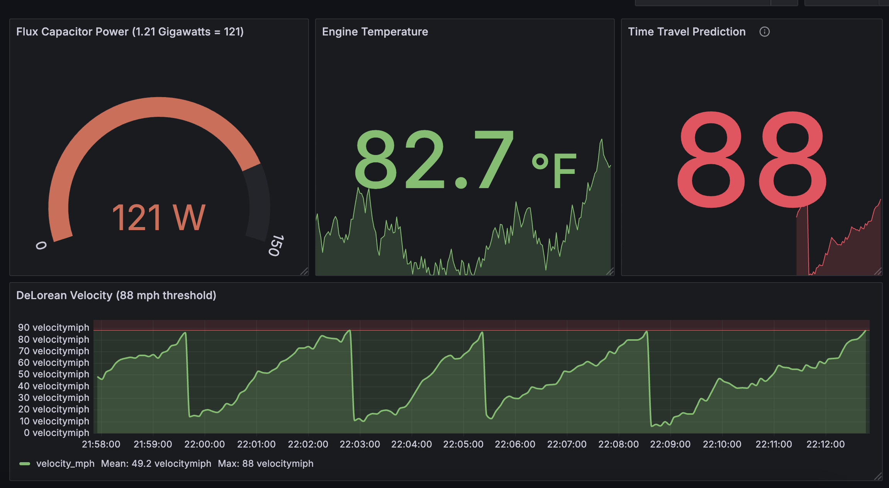
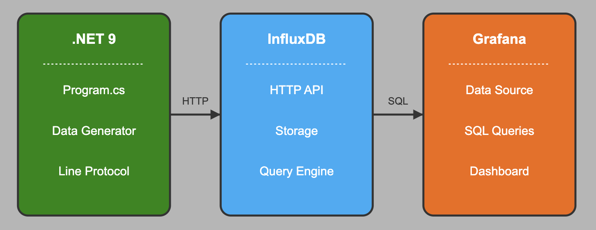

# DeLorean Monitoring - Example for Time Series Data



A demonstration project showing how to work with time series data using modern tools and techniques, all presented with a fun "Back to the Future" theme!

## Architecture Overview

The DeLorean Monitoring system uses a three-tier architecture to collect, store, and visualize time series data:



**Data Flow:**
1. The .NET application generates simulated DeLorean metrics
2. Data is formatted in InfluxDB Line Protocol format
3. Data is sent to InfluxDB Cloud via HTTP API
4. Grafana queries InfluxDB using SQL
5. Dashboards display real-time metrics and analytics

## Prerequisites

### Software Requirements
- **[.NET 9 SDK](https://dotnet.microsoft.com/download/dotnet/9.0)** - Latest version
  - Required for running and building the data generator
  - Minimum version: .NET 9.0 Preview 2 or later
  - Includes required packages:
    - Microsoft.Extensions.Hosting
    - Microsoft.Extensions.Http

- **[Visual Studio Code](https://code.visualstudio.com/)** (recommended) or Visual Studio 2022
  - With C# extension installed
  - Or any IDE that supports .NET development

- **[InfluxDB Cloud Account](https://cloud2.influxdata.com/signup)**
  - Free tier is sufficient for this demo
  - Provides serverless time series database
  - Requires:
    - Organization name
    - API token with write access
    - Bucket with at least 7-day retention

- **[Grafana Cloud Account](https://grafana.com/auth/sign-up/create-user)**
  - Free tier is sufficient
  - For dashboard visualization
  - Ability to add InfluxDB as a data source

### System Requirements
- **Operating System**: Windows 10/11, macOS, or Linux
- **Memory**: Minimum 2GB RAM (4GB recommended)
- **Storage**: At least 100MB free space
- **Internet Connection**: Required for cloud services

### Network Requirements
- Outbound HTTPS access to:
  - InfluxDB Cloud API endpoints
  - Grafana Cloud API endpoints
- No inbound connections required

## Setup Guide

### 1. InfluxDB Cloud Setup

1. **Sign up for InfluxDB Cloud**
   - Go to [InfluxDB Cloud](https://cloud2.influxdata.com/signup)
   - Create a free account or sign in

2. **Create a Bucket**
   - Navigate to "Load Data" > "Buckets"
   - Click "Create Bucket"
   - Name it "gigawatt_metrics"
   - Set retention period to 7 days

3. **Generate API Token**
   - Go to "Load Data" > "API Tokens"
   - Click "Generate API Token"
   - Select "All Access Token"
   - Copy and save this token securely

### 2. DeLorean Data Generator Setup

1. **Clone this Repository**
   ```bash
   git clone https://github.com/Quorralyne/DeLoreanMonitoring.git
   cd DeLoreanMonitoring
   ```

2. **Configure InfluxDB Credentials**
   - Open `Program.cs` in the root directory
   - Update the following variables in the `DeLoreanDataGeneratorService` class:
   ```csharp
   _influxUrl = "https://your-influxdb-url.aws.cloud2.influxdata.com/api/v2/write";
   _influxToken = "your_influx_token_here";
   _influxOrg = "your_org";
   _influxBucket = "gigawatt_metrics";
   ```

3. **Run the Application**
   ```bash
   dotnet build
   dotnet run
   ```
   
4. **Verify Data Generation**
   - You should see console output showing data points being generated
   - Check your InfluxDB Cloud interface to confirm data is being received

### 3. Grafana Dashboard Setup

1. **Create InfluxDB Data Source in Grafana**
   - Sign in to your Grafana Cloud account
   - Navigate to Configuration > Data Sources
   - Click "Add data source" and select "InfluxDB"
   - Configure with these settings:
     - Name: DeLorean_Monitoring
     - URL: Your InfluxDB Cloud URL (without the /api/v2/write path)
     - Query Language: SQL
     - Database: `gigawatt_metrics` 
     - Token: Your InfluxDB API token
   - Add these HTTP Headers:
     - Name: `Authorization`, Value: `Token YOUR_INFLUX_TOKEN`
     - Name: `Content-Type`, Value: `application/json`
     - Name: `Accept`, Value: `application/json`
   - Click "Save & Test"

2. **Import the Enhanced Dashboard**
   - Go to Dashboards > Import
   - Click "Import" in Grafana
   - Upload the `DeLoreanMonitoring/grafana/delorean_monitoring_dashboard.json` file from this repo
   - Select your InfluxDB data source when prompted
   - Click "Import"

3. **Note About Enhanced Dashboard**
   - The dashboard has been optimized with a Back to the Future theme
   - All SQL queries are embedded directly in the dashboard JSON
   - No manual panel configuration is required after import

## SQL Queries for Dashboard Panels

The enhanced dashboard includes the following panels, each with its embedded SQL query:

**Flux Capacitor Power**
```sql
SELECT time, power_level 
FROM "delorean_stats" 
WHERE device = 'flux_capacitor' AND time >= now() - interval '15 minutes'
```

**Current Speed / Time Travel Threshold**
```sql
SELECT time, velocity_mph 
FROM "delorean_stats" 
WHERE device = 'speedometer' AND time >= now() - interval '5 minutes'
```

**Mr. Fusion Fuel Level**
```sql
SELECT time, plutonium_level 
FROM "delorean_stats" 
WHERE device = 'mr_fusion' AND time >= now() - interval '15 minutes'
```

**Time Circuits Power Stability**
```sql
SELECT time, voltage 
FROM "delorean_stats" 
WHERE device = 'time_circuits' AND time >= now() - interval '15 minutes'
```

**Engine Temperature**
```sql
SELECT time, temperature_f 
FROM "delorean_stats" 
WHERE device = 'engine' AND time >= now() - interval '15 minutes'
```

**DeLorean Velocity**
```sql
SELECT time, velocity_mph 
FROM "delorean_stats" 
WHERE device = 'speedometer' AND time >= now() - interval '15 minutes'
```

## Data Metrics

The dashboard monitors various DeLorean time machine metrics that are produced by the data generator:

1. **Flux Capacitor Power**: 
   - Tracks the power level of Doc Brown's key invention
   - Stored as `power_level` in the `flux_capacitor` device
   - Critical value: 121W (representing 1.21 gigawatts)
   - Powers the temporal displacement

2. **Vehicle Velocity**: 
   - Monitors the DeLorean's current speed
   - Stored as `velocity_mph` in the `speedometer` device
   - Threshold value: 88 mph triggers time travel
   - Shows patterns of acceleration and post-time-travel deceleration

3. **Engine Temperature**:
   - Tracks the modified V6 PRV engine temperature
   - Stored as `temperature_f` in the `engine` device
   - Safe range: 60-200°F
   - Critical for stable operation across time periods

4. **Mr. Fusion Fuel Level**: 
   - Tracks the plutonium level in the Mr. Fusion Home Energy Reactor
   - Represents technology from the 2015 timeline in BTTF Part II
   - Stored as `plutonium_level` in the `mr_fusion` device
   - Value range: 0-100%
   - Gradually decreases over time with occasional refueling events

5. **Time Circuits Power Stability**:
   - Monitors voltage fluctuations in the time circuits that control destination time periods
   - Essential for navigation between past, present and future
   - Stored as `voltage` in the `time_circuits` device
   - Normal range: 11-13V with occasional spikes/drops
   - Critical for accurate temporal displacement

## Features

This demo showcases:

1. **High Cardinality Data Handling**: See how InfluxDB efficiently manages millions of unique tag combinations
2. **Efficient Data Writing**: Using Line Protocol for compact, fast data writes
3. **SQL for Time Series**: Industry-standard SQL for complex time-based queries
4. **Real-time Visualization**: Monitor DeLorean metrics as they happen
5. **Predictive Analytics**: Simple forecasting without complex data science
6. **Themed Dashboard**: Back to the Future-inspired visual design

## Dashboard Panels & Time-Based Analysis

The enhanced dashboard provides a complete view of DeLorean metrics through six carefully designed panels, each representing a different aspect of time-based analysis:

### 1. Flux Capacitor Power (Present Status)
- **Type**: Gauge panel showing current power
- **Purpose**: Real-time monitoring of current power levels
- **Insight**: Indicates if the DeLorean has sufficient power for time travel
- **Back to the Future Reference**: Doc Brown's famous "1.21 gigawatts!" exclamation

### 2. Current Speed / Time Travel Threshold (Immediate Future)
- **Type**: Stat panel with area graph
- **Purpose**: Shows proximity to time travel speed
- **Insight**: When this value reaches 88 mph, time travel is imminent
- **Back to the Future Reference**: "88 miles per hour!" threshold for time travel

### 3. Mr. Fusion Fuel Level (Future Technology)
- **Type**: Gauge panel showing percentage
- **Purpose**: Monitors fuel reserves for the time machine
- **Insight**: Indicates if refueling is needed before time travel
- **Back to the Future Reference**: The Mr. Fusion Home Energy Reactor from BTTF Part II (2015 timeline)

### 4. Time Circuits Power Stability (Temporal Navigation)
- **Type**: Time series chart
- **Purpose**: Monitors voltage stability over time
- **Insight**: Fluctuations could result in inaccurate temporal destinations
- **Back to the Future Reference**: The time circuits that allow specific date selection for past/future travel

### 5. Engine Temperature (Present + Recent Trends)
- **Type**: Stat panel with area graph
- **Purpose**: Current reading with immediate historical context
- **Insight**: Shows if engine temperature is stable or fluctuating
- **Importance**: Critical for safe operation across different time periods

### 6. DeLorean Velocity (Historical Analysis)
- **Type**: Time series chart over 15 minutes
- **Purpose**: Historical pattern analysis
- **Insight**: Shows velocity patterns with 88 mph threshold line
- **Back to the Future Reference**: Each spike to 88 mph followed by a drop represents a time travel event
- **Pattern**: The recurring build-up to 88 mph shows multiple time travel occurrences

## Project Structure

- **Program.cs**: Main .NET console application for generating time series data
- **DeLoreanMonitoring.csproj**: Project file for the .NET application
- **grafana/delorean_monitoring_dashboard.json**: Grafana dashboard configuration
- **bin/**: Build output directory
- **obj/**: Intermediate build files

## Troubleshooting

### No Data in InfluxDB
- Verify your API token and organization name
- Check network connectivity to InfluxDB Cloud
- Confirm the bucket "gigawatt_metrics" exists

### Grafana Dashboard Issues
- Ensure your data source configuration is correct
- Verify that the InfluxDB data source name exactly matches "DeLorean_Monitoring"
- Check that the time range includes data points
- If some panels show no data, verify that your data generator is producing all the expected metrics

### .NET Application Errors
- Make sure all required packages are installed
- Check for runtime errors in the console output
- Verify that the configuration variables are set correctly in Program.cs

## Build From Scratch
- A PDF guide of the how the full project was done from scratch is included at the top level of this repo. If you don't want to clone the project and run it, follow the guide for each step of the process.
- FILENAME: Complete Demo Guide - DeLorean Dashboard - Back to the Future of Time Series Data.pdf

## Acknowledgments

- Inspired by the "Back to the Future" movie trilogy
- Built with InfluxDB 3 Cloud Serverless, .NET 9, and Grafana Cloud
- Special thanks to Doc Brown and Marty McFly for the DeLorean specs 🚗⚡
